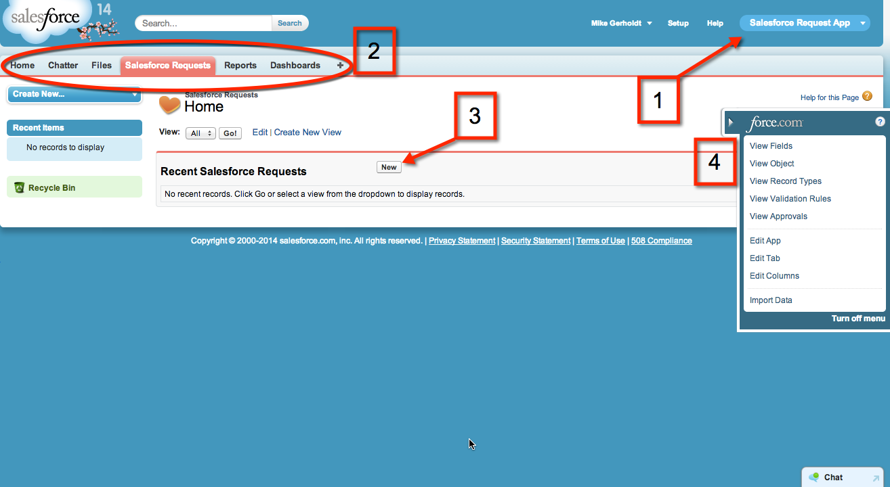

1. **Force.com app menu** 
  - Shows the apps that you are available to you. The app you just created is selected.

2. **Tabs** 
  - Provide an easy way to find and organize objects and records within an app. In the Salesforce Requests tab you can create, view, and edit records. The other tabs are the standard feature tabs that are included with every app.

3. **Create records** 
  - Click **New**  to add records to your custom object. If you click this button now, you see only one data entry field in the object, but you’ll create more in the following steps.

4. **Force.com Quick Access menu**
  - Quickly jump to relevant app customization features. It’s available from any object list view page and record detail page, but only for users with the _Customize Application_ permission.

## Tell me more

An app is composed of tabs, but the tabs don’t have to be related to each other. In fact, you can modify custom apps to group all of your frequently used tabs together in one place. 

For example, if you refer to the Accounts tab a lot, you can add that to the Salesforce Request App. You can switch between apps you created, bought, or installed by selecting them from the menu.

<a href="01-creating-an-admin-app.html" class="btn btn-default"><i class="glyphicon glyphicon-chevron-left"></i> Previous</a>
<a href="03-adding-fields-to-the-salesforce-request-object.html" class="btn btn-default pull-right">Next <i class="glyphicon glyphicon-chevron-right"></i></a>

