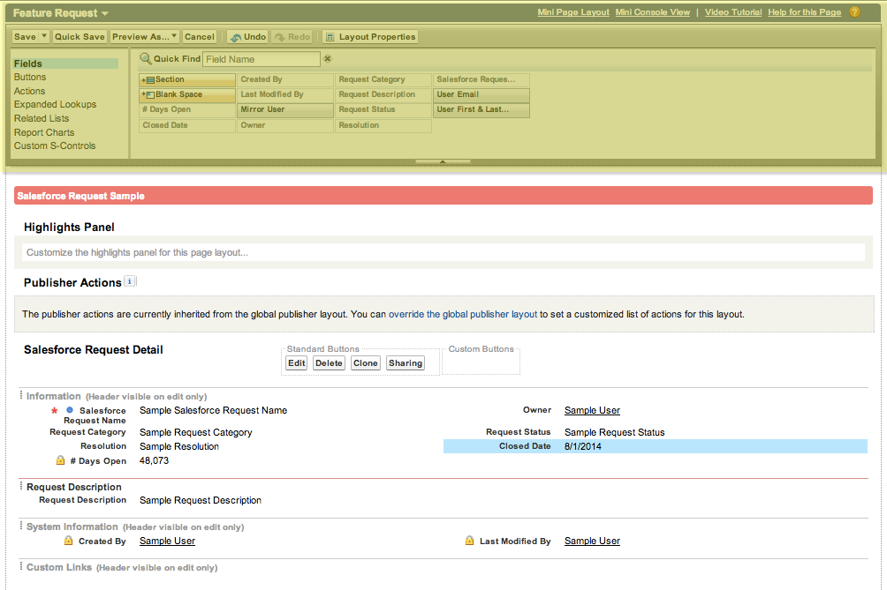
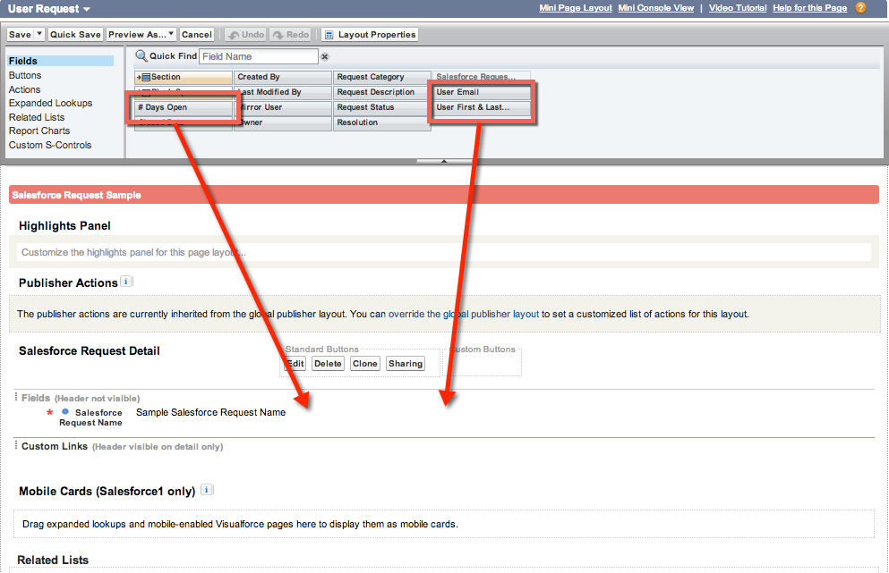

In the previous exercise you created fields to manage the data. Now we want to make sure that user has a great experience logging the Salesforce request by only serving up relevant fields. In order to accomplish this we will create two page layouts and two record types. This will meet our business requirement by allowing us to capture relevant information based on the request.

In this exercise we will create the page layouts.

1. Click **Setup** | **Create** | **Objects** | **Salesforce Request**

2. Scroll down to the Page Layouts section. There is already one Page Layout there which we will edit. Then we will create an additional page layout.

3. Click **Edit** next to the Page Layout named “Salesforce Request Layout”, this will open the Page Layout Editor.

4. In the Page Layout Editor click on the top button called **Layout Properties**.

5. Change the name to `Feature Request`

6. Then click **OK**.

7. Now that we are back in the Page Layout Editor let’s remove fields that aren’t relevant to a Feature Request. To do that click on the following fields and drag them _into_ the retractable toolbox called the palette (highlighted in the following image)

  a. Drag the following fields to the palette:
    User First & Last Name
    User Email
    Mirror User

Now Let’s rearrange the remaining fields and add a new section.

8. We will start by adding a new section for `Request Description`. From the palette click on **Section** and drag it down until a green bar appears above System Information.

9. In the `Section Properties` box enter the Section Name `Request Description`

10. Choose `1-column` for the Layout

11. Then click Ok.

12.  Now drag your `Request Description` Field into your new section.

13. Rearrange remaining fields by dragging them around.

14. Then click **Save**.

## Add a New Page Layout to the Object
Scroll down to the Page Layouts section of the Salesforce Request Object.

1. Click the **New** button.

2. Leave `--None--` as value in the Existing Page Layout.

3. Enter `User Request` in the Page Layout Name

4. Leave the **Feed-Based Layout** box unchecked.

5. Click  Save.

6. Now add the following fields that are needed for a New User Request to the page Layout by dragging them _from_ the palette and arranging as needed.

    User First & Last Name		User Email
    Mirror User				#Days Open
    Closed Date				Request Status
    Request Category

7. Click Save.

<a href="03-adding-fields-to-the-salesforce-request-object.html" class="btn btn-default"><i class="glyphicon glyphicon-chevron-left"></i> Previous</a>
<a href="05-adding-record-types.html" class="btn btn-default pull-right">Next <i class="glyphicon glyphicon-chevron-right"></i></a>

