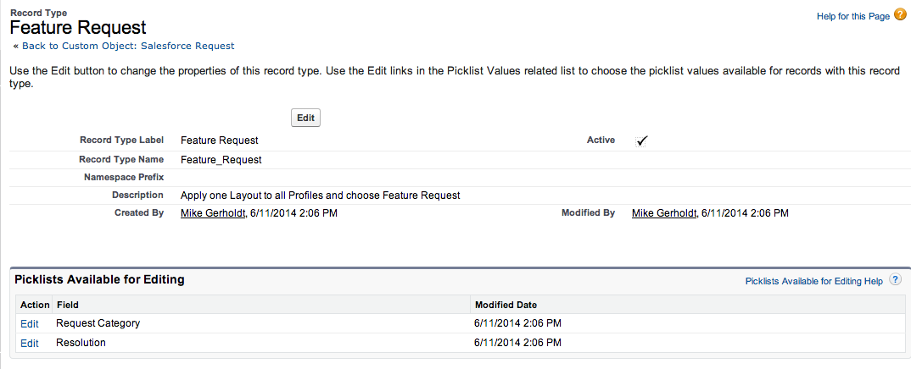
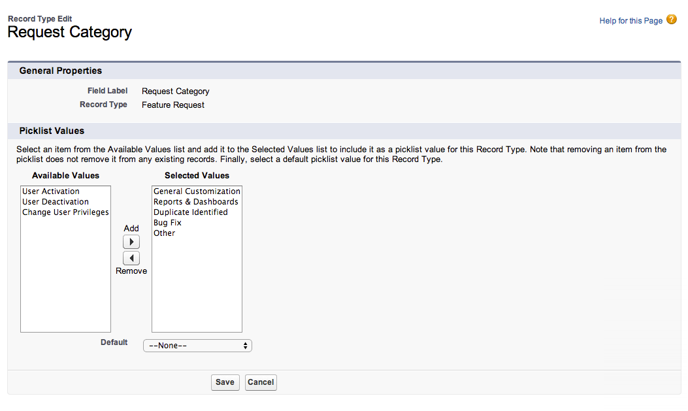
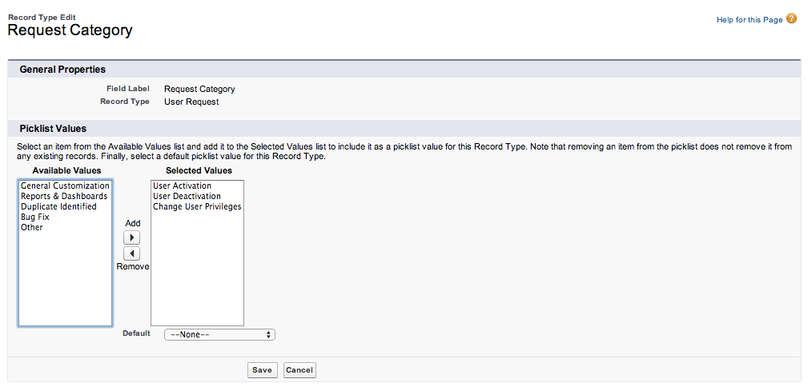

In this exercise you will go a step further by learning advanced point-and-click development to further enhance the underlying database and improve the user interface.

## Automate a Field Update using Workflow
Let’s make it easy on the Admin so they only need to add a Closed Date and have the status update automatically to Closed.

1. From Setup, click **Create** | **Workflow & Approvals** | **Workflow Rules**.

2. Optionally, read the brief introduction, click **Continue**, and then click **New Rule**.

3. Select the `Salesforce Request` object, and click **Next**.

4. For the rule name, enter `Update Status to Closed`, and for the description enter `Updates status to Closed when Closed Date field is populated`

5. For the evaluation criteria, select **created, and any time it’s edited to subsequently meet the criteria**

6. For the first rule criteria row, for the field select **Salesforce Request: Closed Date**, for the operator select **Not Equal to**, and for the value leave blank.

7. Click **Save & Next**.

Continuing on, the next step is to assign an action to the workflow rule to update the Request Status field automatically.

1. Click the drop-down list that reads **Add Workflow Action** and choose **New Field Update**.

2. In the Name field enter `Update Status to Closed`

3. In the Field to Update list, choose `Request Status`

4. Choose a `Specific value of Closed`

5. Click **Save** and then click **Done** to return to the detail page of the new workflow rule.

6. From the Workflow Rule detail page click the **Activate Button**.

## Try out the App!
Go back to the request and populate the Closed Date field. Did the status change? You can use workflows to automate other aspects of this app, too.

In the previous exercise you created Page Layouts to give the user a great experience logging the Salesforce request by only serving up relevant fields. In this exercise we want to map those Page Layouts to Record Types so that the user can select either User Requests or Feature Requests and see the correct Page Layout and Record Type. This will meet our business requirement by allowing us to report on User Requests versus Feature Requests.

### Add a User Request Record Type

1. On the Salesforce Request Custom Object, scroll down to the Record Types section and click the **New** button.

2. For Record Type Label enter `User Request`

3. For Description enter `Use for User Activation Requests or User Deactivations`

4. Make sure the **Active** box is checked and click **Next**

5. Keep the radio button on the `Apply one Layout to all Profiles` and choose `User Request` from the picklist.

6. Then click **Save & New** to add a second Record Type.

### Add a Feature Request Record Type

You should already be in the New Record Type wizard, so you can create the Feature Request Record Type in the same manner.

1. For Record Type Label enter `Feature Request`

2. For Description enter `Use for Feature Requests, Bug Fixes, and Report/Dashboard Requests`

3. Make sure the **Active** box is checked and enable it for all profiles

4. Click the top **Enable for Profile** to enable this record type for all profiles. (By enabling a Record Type for a profile, anyone with that profile can use it.)

5. Then click **Next**

6. Keep the radio button on the `Apply one Layout to all Profiles` and choose Feature Request from the picklist.

7. Then click Save to add that Record Type.

Another benefit of adding Record Types is that now we can limit the picklist values based on the Record Type the user selects. In the following exercise we will edit the Request Category picklist value for the Feature Request Record Type we just created.

1. Next to Request Category click Edit.

2. Select User Activation, User Deactivation and Change User Privileges and move them to the Available Values column by clicking the Remove button.

3. Then Click Save.

Repeat the same process for the User Request Record Type having only the User Activation, User Deactivation, and Change User Privileges as selected values.

Remember the Remove button will move highlighted values from the Selected Values column to the Available Values column. The Add button will move highlighted values from the Available Values Column to the  Selected Values column. 

## Try out the App
Click the New button and fill out a Salesforce Request. How is the experience different now that we added Record Types and Page Layouts? What are some ways we can automate and add logic to this app?

<a href="04-adding-page-layouts.html" class="btn btn-default"><i class="glyphicon glyphicon-chevron-left"></i> Previous</a>
<a href="06-app-logic-with-clicks.html" class="btn btn-default pull-right">Next <i class="glyphicon glyphicon-chevron-right"></i></a>

