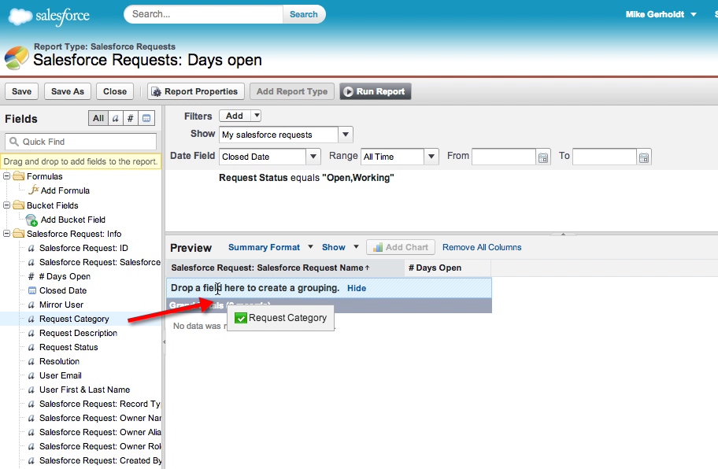
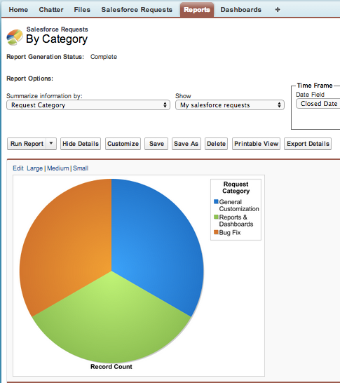

The report builder gives you a lot of ways to view your data.  Viewing data in groups usually helps make sense of what you’re looking at. In this case, grouping by Category, or Record Type can be helpful.

First we’ll turn our simple tabular report into a slightly fancier summary report, and then we’ll give it a grouping.

1. From the Report Results view, Click **Customize**.

2. The default format is tabular, but we want a summary report. Click **Tabular Format** and choose **Summary** instead. Click **Yes** at the warning box.

3. Find and drag the Request Category field to your report in the shaded area **Drop a field here to create a grouping**

4. Click Run Report.

The report is now grouped by `Request Category`, and it includes the sum of the requests. To  Save this report click **Save As** and enter `Salesforce Requests: By Category` as the name.

Click **Save & Return** to Report

## Show your Report Data as a Chart
It’s often a good idea to give users a visual way to understand the data in your report. Let’s add a pie chart to our Salesforce Requests: By Category report.  

1. Click Customize

2. In the Preview pane, click **Add Chart** to create a chart to represent your data. In the Chart Editor that appears click the Pie Chart.

3. In the `Values` picklist choose **Record Count**, and in the `Wedges` picklist choose **Request Category**.

4. Click OK, then **Save**.

5. Click **Run Report**.

The Pie Chart shows the total number of Salesforce Requests by Category.

<a href="08-creating-a-dashboard-and-reports.html" class="btn btn-default"><i class="glyphicon glyphicon-chevron-left"></i> Previous</a>
<a href="10-create-a-dashboard.html" class="btn btn-default pull-right">Next <i class="glyphicon glyphicon-chevron-right"></i></a>

