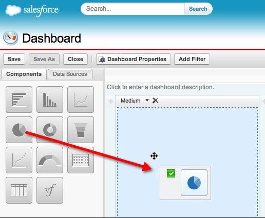
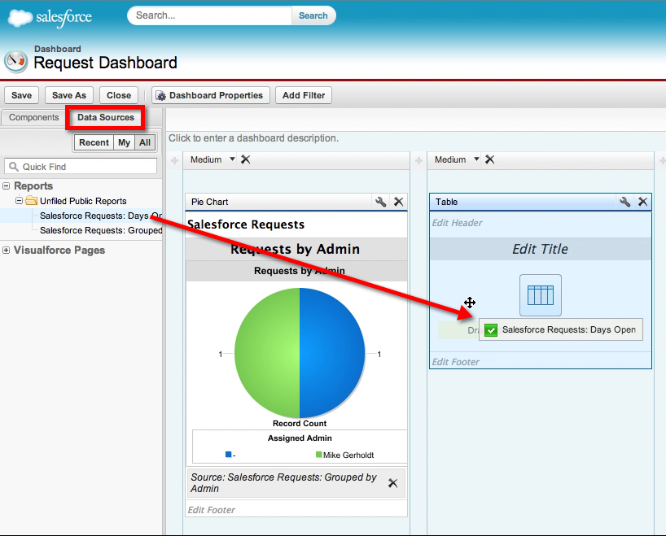
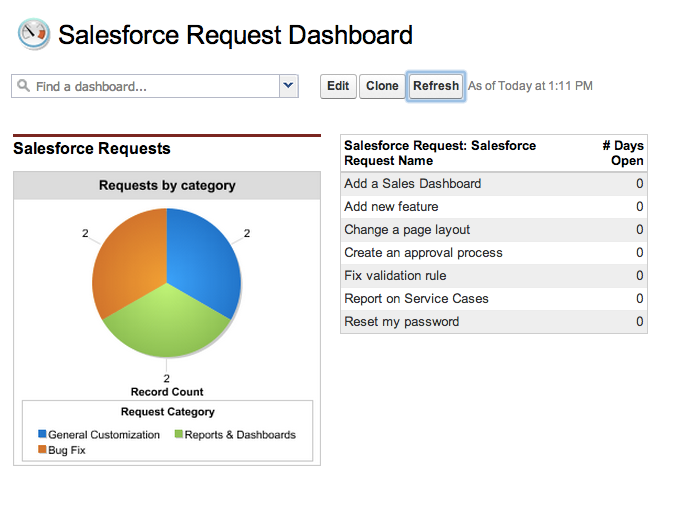

Dashboards in Salesforce are like a dashboard in your car, showing you important information at a glance. Dashboards can show data in charts, gauges, tables, metrics or Visualforce pages. 

In this exercise you will create a new dashboard that’s powered by the reports you created previously.

1. Click the **Reports** tab and then **New Dashboard**.

1. Click the editor’s **Components** tab, then drag the **Pie Chart** component and drop it in the first column of the new Dashboard.

1. Now click the editor’s **Data Sources** tab, and under **Reports >  Unfiled Public Reports**, drag the `Salesforce Requests: By Category` report and drop it on top of the Pie Chart component that in the dashboard.

1. Add a header title of `Salesforce Requests` by clicking on the **Edit Header**.

1. Add a title `Requests by Category` by clicking on the **Edit Title**.

1. Click **Save** and name the Dashboard `Salesforce Request Dashboard`

1. Click **Save and Run Dashboard**

That was so easy. Why not play around with adding a different type of dashboard component, just for fun?

1. Click Edit, and this time use a Table component in the second column.

1. Your Data Source for this component will be the Salesforce Requests: Days Open report.

1. Then click Remove this column (the X icon) in the header of the third column to remove the unused third column from the layout. Click **Save**

1. Click **Close**

After you close the editor the dashboard then runs automatically. Your Dashboard should look something like the one below.

## Tell me more...

* When you set a running user for a dashboard, it runs using the security settings of that single, specific user. All users with access to the dashboard see the same data, regardless of their own personal security settings. To set the running user, click the down arrow next to the View dashboard as field.

* Dashboards can be updated either manually or on a schedule, and they can be delivered through email and mobile.

* A dashboard won’t automatically refresh unless it is set to do so. Each time you view a dashboard, it indicates in the upper-right corner when it was last refreshed. To update the data in the dashboard, click **Refresh**.

* Try adding a filter when editing the dashboard by clicking **Add Filter**. A filter lets you see different views of dashboard data based on filter conditions. You can add up to three filters per dashboard with up to ten conditions on a filter. Instead of filtering at the report level, you directly manipulate dashboard data.

<a href="09-get-more-information-from-your-report.html" class="btn btn-default"><i class="glyphicon glyphicon-chevron-left"></i> Previous</a>
<a href="11-bonus-create-field-using-schema-builder.html" class="btn btn-default pull-right">Next <i class="glyphicon glyphicon-chevron-right"></i></a>

